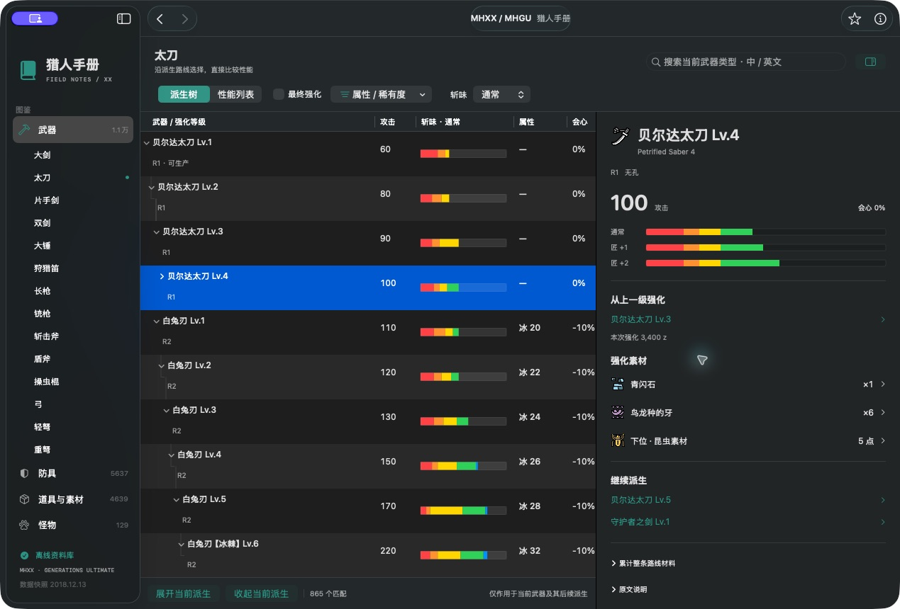
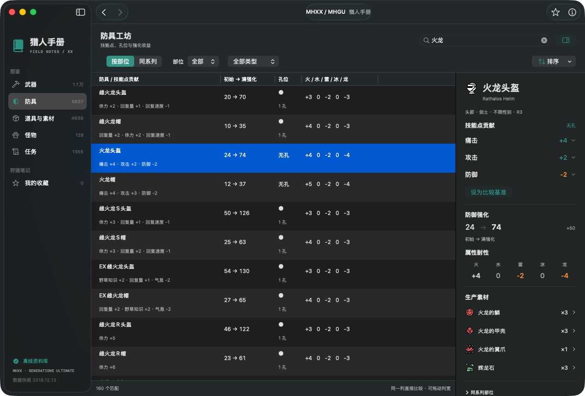
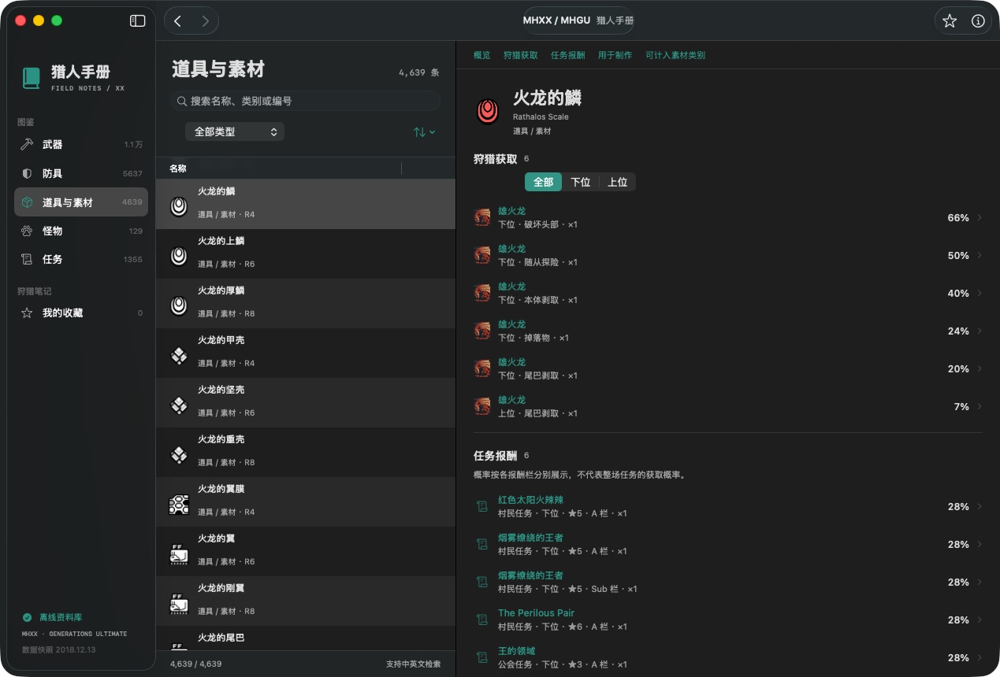

# 猎人手册 · HunterDex

一个独立实现的 macOS 原生 MHXX / MHGU 离线百科预览版。SwiftUI 界面，SQLite 数据库，无第三方运行时依赖。

## 下载与安装

前往 [GitHub Releases](https://github.com/Drafffffff/HunterDex/releases/latest) 下载 `HunterDex-0.4.0-macOS-arm64.zip`，解压后将 `HunterDex.app` 拖入「应用程序」。应用内置数据库，使用时不需要联网。发布页同时提供 SHA-256 校验文件。

发布包采用临时签名，尚未经过 Developer ID 签名或 Apple 公证。macOS 首次打开时可能拦截；确认下载来自本项目后，可在「系统设置 → 隐私与安全性」中允许打开。

## 界面截图

以下截图来自 macOS 上实际运行的 v0.3.0（深色外观），点击图片可查看原图。

### 武器派生与强化

按武器类型浏览派生树，列表直接展示斩味；右侧查看当前武器的强化素材、前后派生和不同匠等级的斩味。



### 防具技能与属性

中英文名称与技能搜索，列表并排比较技能点、孔位、防御和耐性，详情突出技能贡献与满强化收益。



### 素材获取途径

从装备素材直接跳转，按位阶查看剥取、部位破坏和任务报酬，并继续关联到怪物与任务。



## 从源码构建

系统要求：macOS 14 或更高版本；当前构建为本机 Apple Silicon 架构。

```sh
swift run HunterDex
```

生成 `.app`（先退出正在运行的猎人手册）：

```sh
zsh scripts/build-app.sh
open dist/HunterDex.app
```

需要 Swift 6.0 或更高版本（Apple Command Line Tools 或 Xcode）；不需要安装外部 Swift 包。构建使用已提交的数据资源，不需要 Python 或本地技能。生成的应用位于 `dist/HunterDex.app`，架构与构建主机一致。

## 0.3 体验重构

- 搜索移到后台执行，预先建立规范化文本和名称排序索引，输入防抖 120 ms，取消旧查询并拒绝过期结果。原生搜索框在输入法组词期间不触发搜索。
- 列表改用 AppKit 复用行，避免为整个数据库同时构建 SwiftUI 视图。搜索仍限定当前分类／武器类型。
- 14 类武器独立浏览，派生树和性能列表切换；树节点可直接跳转，筛选时保留祖先作为路线参照。近战列表直接显示等比例斩味，可切换通常、匠 +1、匠 +2。
- 武器详情提供前后派生、生产／强化素材；设定已有武器为起点后，可累计同一路线的升级费用与素材，素材点数类别单独保留。
- 防具列表突出技能点和孔位，详情展示初始 → 满强化、防御增量、五属性耐性和技能发动阈值。可将同部位防具设为比较基准；同系列视图按数据库套装关系分组。
- 中英文搜索、类型／属性／稀有度筛选、排序、收藏和前后导航。各武器类型保留独立搜索、树展开和滚动上下文。
- 内置 205 个图标和 91 张怪物插画。武器与防具仍使用类别／部位图标，尚无逐件装备外观图。
- 深浅外观跟随 macOS；⌘F 搜索、⌘D 收藏、⌘[ / ⌘] 前后浏览。

中文覆盖（包含原有中文层；名称覆盖率按数据库记录统计）：

| 类型 | 中文 / 总数 |
| --- | ---: |
| 武器等级记录 | 10,877 / 10,877 |
| 防具 | 5,637 / 5,637 |
| 普通道具／素材 | 2,624 / 2,624 |
| 强化素材点数类别 | 277 / 277 |
| 装饰珠 | 242 / 242 |
| 任务名称 | 1,355 / 1,355 |
| 随从猫防具名称 | 1,001 / 1,001 |
| 随从猫武器名称 | 495 / 495 |
| 道具与装备说明（唯一原文） | 7,625 / 7,625 |

普通道具名称现已全部汉化。任务名称和 843 种不同的主／副任务目标也均已汉化；猎人防具名称已全覆盖，猎人武器 10,877 / 10,877 个等级记录已全覆盖，随从装备名称已全覆盖。道具、武器和随从装备的说明文案已完成 7,625 种唯一原文的汉化。普通道具新增译名及可重复导入流程见 `scripts/import-reviewed-gap-item-names.py`、`scripts/import-unappraised-items.py`；唯一属性匹配的武器补充导入见 `scripts/import-unique-gap-weapon-names.py`，项目审校的武器系列名称见 `scripts/import-reviewed-weapon-gap-names.py`；唯一属性匹配的防具补充导入见 `scripts/import-unique-gap-armor-names.py`，套装属性序列唯一匹配见 `scripts/import-unique-armor-family-names.py`，系列前缀配合数据库部位和稀有度筛选，兼容中文库明示的通用性别或猎人类型，只导入唯一候选见 `scripts/import-unique-armor-term-names.py`；守护者与巨兽系列的项目审校译名见 `scripts/import-reviewed-armor-names.py`；说明译文脚本见 `scripts/extend-description-localization.py`。未翻译名称概览见 `LOCALIZATION-COVERAGE.json`，完整说明缺口见 `DESCRIPTION-LOCALIZATION-COVERAGE.json`；译名来源分别记录在 `LOCALIZATION-SOURCES.json`、`LINKED-LOCALIZATION-SOURCES.json`；图片来源在 `ARTWORK-SOURCES.json`。

装备名称按完整强化序列或装备数值唯一匹配；随从防具按防御力、五种属性耐性和稀有度区间唯一匹配；新增素材名按怪物／地图、位阶、部位、数量与概率组成的掉落记录，或跨地点采集分布、稀有度和携带上限唯一匹配；道具详情按稀有度、携带上限和已匹配任务报酬组合唯一匹配；任务按会场、星级、地图、怪物和目标类型匹配。存在歧义时不自动覆盖。社区译名仍可能存在用词差异。

收藏保存在应用的 UserDefaults 中。设计方案见 `docs/0.3-experience-plan.md`，本轮验证与边界见 `docs/0.3-validation.md`。

## 验证

本机 Command Line Tools 不提供 XCTest，因此内置无外部测试框架的自检入口：

```sh
swift run HunterDex --self-test
dist/HunterDex.app/Contents/MacOS/HunterDex --self-test
```

检查数据库完整性与条目数量、强化树父子关系、武器→素材→任务的双向关联、代表性页面的链接有效性、筛选与中文搜索、浏览历史、收藏持久化。自检使用独立的随机 UserDefaults 域，不修改用户收藏；失败时返回非零退出码。

## 数据与边界

主数据库来源：[gatheringhallstudios/MHGenDatabase](https://github.com/gatheringhallstudios/MHGenDatabase)，快照日期 2018-12-13，MIT 许可原文随应用资源一同打包。复制本地快照后仅添加查询索引，没有修改游戏数据。数据库有 10,877 条武器记录（包含强化等级）、5,637 条防具、1,355 个任务。

原始中文词典整理自 `mhgu-encyclopedia` 的社区翻译层，其来源包含 [AngryChocobo/monster-hunter-web-data](https://github.com/AngryChocobo/monster-hunter-web-data) 和 [jestar719/mhgu](https://github.com/jestar719/mhgu)。武器、防具新增中文层见 `localization.json`；新增道具、任务、技能效果和地图修正见 `linked-localization.json`；部分中文覆盖仍不完整。词典原始说明保存在 `zh.json` 的 `note` 字段中。

当前不包含自动配装、完整弩弹表、逐件装备外观图、狩技、猫技能及猫饭。怪物页面的弱点评分不是部位肉质。任务报酬概率按各栏独立展示；不能当作整场任务的掉率。数据库中的缺项不代表游戏中不存在。

本项目受离线怪猎百科工作流启发，未使用 Ping’s Dex 的程序、数据库或图片，与其作者及 CAPCOM 无隶属关系。

## 代码

- `Sources/HunterDex/Database.swift`：只读 SQLite 查询、中文层、详情及关联。
- `Sources/HunterDex/Artwork.swift`：离线图片加载与缓存。
- `Sources/HunterDex/Store.swift`：筛选、选择、历史、收藏。
- `Sources/HunterDex/SearchEngine.swift`：后台搜索与详情缓存。
- `Sources/HunterDex/EquipmentTable.swift`：原生复用列表与派生树。
- `Sources/HunterDex/EquipmentWorkspace.swift`：武器／防具专用工作区。
- `Sources/HunterDex/RoutePlanner.swift`：升级路线与素材累计。
- `Sources/HunterDex/ContentView.swift`：导航与通用图鉴页面。
- `Sources/HunterDex/SelfChecks.swift`：可在 Command Line Tools 环境运行的验证。
- `scripts/build-app.sh`：生成可搬移的 macOS 应用。

后续优先补充片手剑 / 狩猎笛中文名、逐件装备外观图，再接入配装求解器。

## 许可证与贡献

原创程序、脚本和文档采用 [MIT License](LICENSE)。第三方数据库、社区翻译与游戏图片的来源和许可范围见 [第三方说明](THIRD_PARTY_NOTICES.md)；这些素材不因本项目开源而统一改为 MIT。

欢迎通过 [Issues](https://github.com/Drafffffff/HunterDex/issues) 反馈错误译名、数据问题或交互建议，也欢迎提交 Pull Request。修改后请运行 `swift run -c release HunterDex --self-test`。

`scripts/` 中除打包脚本外的数据整理工具供维护者使用，不参与应用构建。它们需要 Python 3、BeautifulSoup 4 及 `.cache/data-sources/` 中的上游资料快照；具体输入见各脚本。`extend-localization.py` 额外通过 `--goal-translator /path/to/build_zh.py` 显式接收原词典工具（接口为 `GOAL_ALIASES`、`GOAL_ITEMS`、`synth_goals`），仓库未分发该外部工具。完整重新导入数据目前不是一键流程；日常构建直接使用仓库中的已核验快照。
